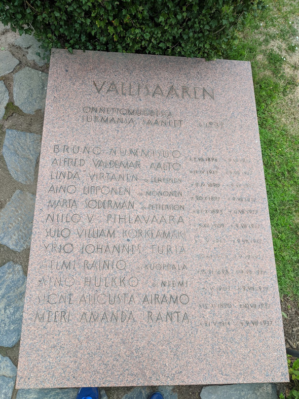

# Kivi

I visited Helsinki in 2018. I thought it was a beautiful city, full of history that reflected Finnish design sensibilities. It was inspirational. One thing that particularly struck me was a war memorial on Suomenlinna designed by [Elsi Borg](https://en.wikipedia.org/wiki/Elsi_Borg). The typography on this monument was sublime: solid and full of integrity but suggesting fragility and ephemerality. 

  
  

Designed by [Measure + Fit](http://measureandfit.co) in 2020.
